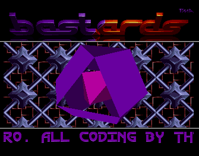
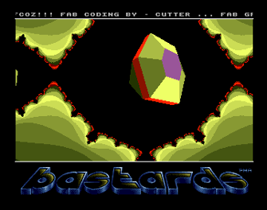
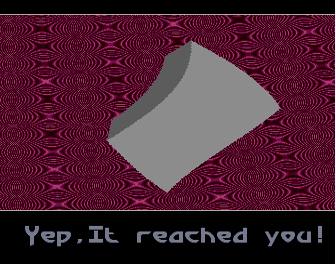
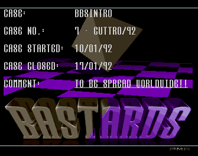
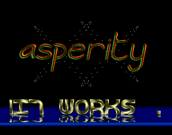
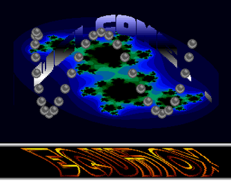
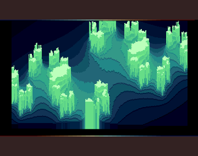
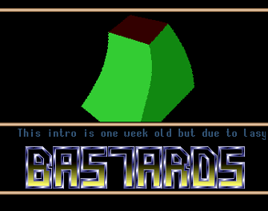

# Amiga

## Demos
I was a part of the 'scene - yuuup, the good 'ol scene. Those were the days ... greetz to [Bastards](http://janeway.exotica.org.uk/author.php?id=1938), [Asperity](http://janeway.exotica.org.uk/author.php?id=29050), [Disorder](http://janeway.exotica.org.uk/author.php?id=25712), [Cyber Visions](http://janeway.exotica.org.uk/author.php?id=59937), [Kefrens](http://janeway.exotica.org.uk/author.php?id=665) and others!

No source code is available. But click on the image to go to the [Janeway](http://janeway.exotica.org.uk/author.php?id=7811) entry.

