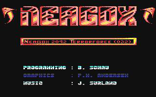
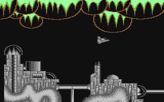
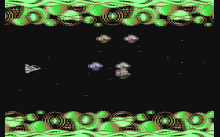

# Commodore 64

## Neagox
This is a small (unfinished) game for the Commodore 64. We were three guys (me, Peter and Jacob) and we submitted the game to Hewson. Got good grades for the graphics, the music and the overall technical implementation. We got shitty grades for the gameplay and the overall design of the levels. You know, the stuff that matters.

It's a shitty game.

### Downloads

* [The music](neagox.mp3)
* [The game](neagox.zip) - sorry, the source code is gone

