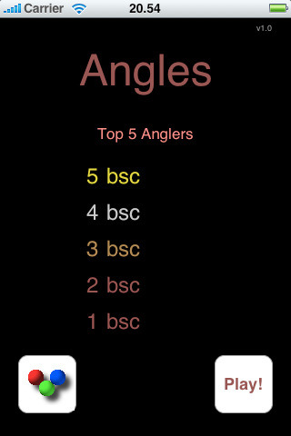
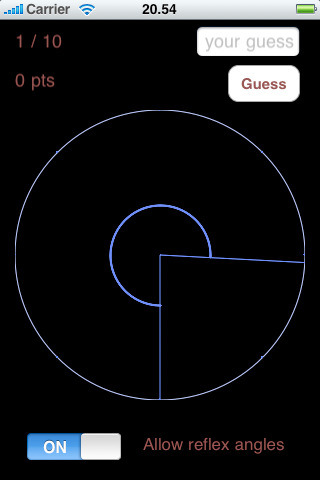
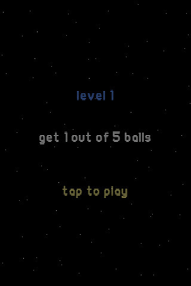
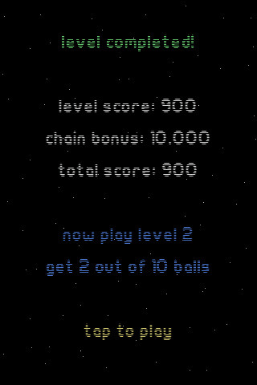
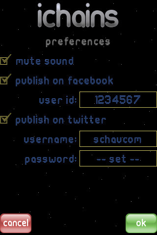
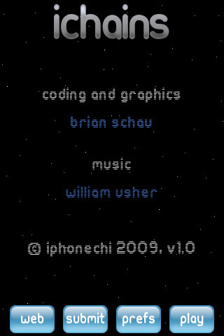
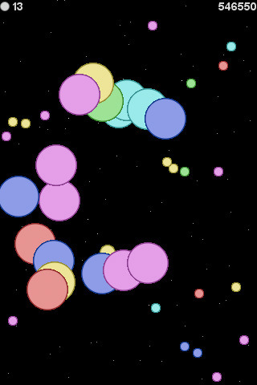

# iOS

As the rest of the world I've also created apps / games for the iPhone (or rather the iOS series of devices).

None of these are live in the App Store anymore.

## Angles
In Angles you must guess the value of 10 angles. The closer your guess is to the actual angle, the higher you score. Angles is primarily for pupils in the lower grades.

Angles currently comes with support for the following languages: English and Danish.

Go to [Angles source code](Angles/).

## iChains
In iChains you have to score points by exploding balls. To explode balls you must set of one or more chain reactions. The longer the chain the more points you score.
The game consists of 12 levels - each level gets progressively harder but all levels can be completed within a reasonably amount of time.
If you feel like it you can submit your personal best and hopefully achieve a position on the online iChains Top 100 List.

Go to [iChains source code](iChains/).

