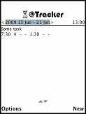
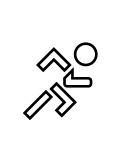
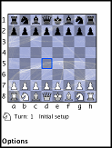
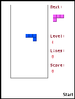
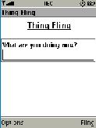
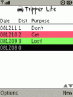

# J2ME

Java 2 MicroEdition (J2ME) programs for the old Nokia Series 30, 40 and 60 and Ericsson phones.
J2ME programs are written in Java. The _Build Tools_ folder contains some of the build tools I developed for my own usage.

Yuuuup - been there, done that!

Without screenshots:

* [Build Tools](buildtools/)
* [Eyes](eyes/)
* [P4 Remote](P4Remote/)
* [Tic Tac Toe](TicTacToe/)
* [Yrthwyrm 2](Yrthwyrm2/)
