# Palm OS

The period where I developed for the Palm OS is probably my most active period. I was almost in love with the platform :-)

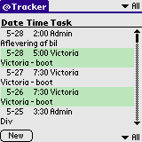
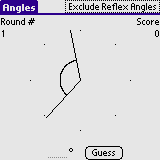

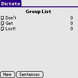
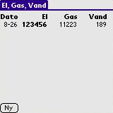

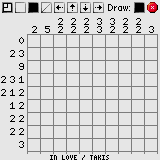

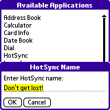
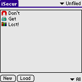
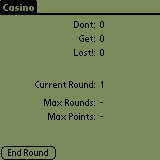
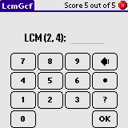
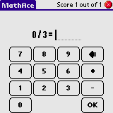
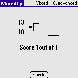
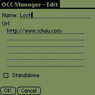
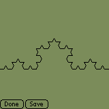
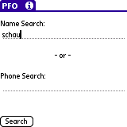
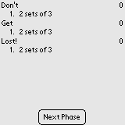
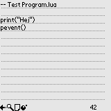
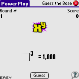
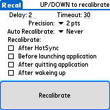
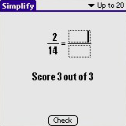
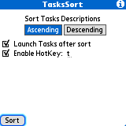

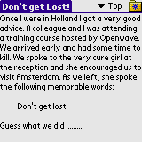

Without screenshots:

* LoginMan
* Secure It
