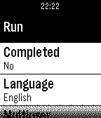

# Pebble

The Pebble Smartwatch was a totally awesome smartwatch and I created a couple of apps for it.
The apps are written in _c_.

All archives contains a compiled _.pbw_ file ready to install to your watch. Some of the apps even contains a companion app for your phone.

## 10-20-30
Follow the 10-20-30 run program.

Go to [10-20-30 source code](TenTwentyThirty/).

## Big
Watchface with big numbers.

Go to [Big source code](Big/).

## esignatur Watchface V2
Probably only for me.

Go to [esignatur Watchface V2 source code](esignaturWatchfaceV2/).

## First 5km
Run program for your first 5km.

Go to [First 5km source code](First5km/).

## Fuzzy Dk
Watchface - show fuzzytime in danish.

Go to [Fuzzy DK source code](FuzzyDk/).

## LCD
Watchface - LCD, looks quite good on the Pebble Round.

Go to [LCD source code](LCD/).

## Lights
Watchface - lights light up every second.

Go to [Lights source code](Lights/).

## Ray
Watchface - beams and heartrate.

Go to [Ray source code](Ray/).

## Sleep Time
Watchface - shows when to sleep and when to be awake.

Go to [Sleep Time source code](SleepTime/).

## Walkr
Monitor steps and calories burnt.

Go to [Walkr source code](Walkr/).

## Whip
Program to help you exercise run intervals.

Go to [Whip source code](Whip/).

## ww Timer
Egg timer and stopwatch in one app.

Go to [ww Timer source code](wwTimer/).

